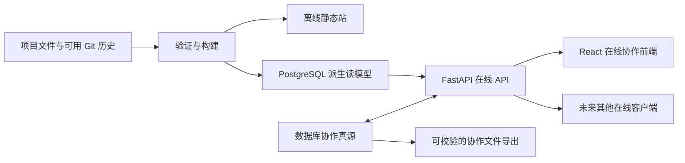

# 技术栈与两个前端的分工

采用 Python + FastAPI、PostgreSQL、React + TypeScript + Vite 作为下一轮实现候选；现有离线静态站继续独立运行。本轮仅确定职责与契约，没有安装这些新栈、创建数据库或实现协作客户端。

## 当前已存在的部分

`src/` 保存 HTML、CSS、JavaScript 页面代码，`build.py` 从项目文件生成 `site/`。本机已有构建依赖与使用方法以仓库根 README、requirements.txt 为准。离线站双击即可阅读，运行时不访问 API、数据库或网络。

这不是一次将现有网页重写成 React 的任务。已有静态站承担：项目资料阅读、需求与产物关联、Git 差异审查、离线接手和导出草稿。

## 设计候选及理由

| 层 | 设计选型 | 对本项目的作用 | 真实状态 |
|---|---|---|---|
| 在线后端 | Python + FastAPI | 使用 Python 类型与校验模型实现已审阅契约，提供派生资料读取、协作事务和导出接口 | 无后端代码，版本待实现时锁定 |
| 在线数据库 | PostgreSQL | 用外键、唯一约束、事务和并发控制维护派生投影与协作事务 | 无实例、无执行过的 DDL |
| 在线协作前端 | React + TypeScript + Vite | 按共享契约呈现在线讨论与认领等功能；TypeScript 约束组件和客户端类型，Vite 负责开发及构建工具链 | 无实现、无安装 |
| 离线阅读前端 | 保留现有原生静态站 | 不依赖服务、账号、数据库或网络的接手入口 | 第2轮已有；第3轮增量验收另记 |

FastAPI 官方说明其基于 OpenAPI 和 JSON Schema 提供接口、模型文档并支持客户端生成；这为契约校验和后续客户端生成提供基础，并不自动保证业务接口正确。[FastAPI 官方功能说明](https://fastapi.tiangolo.com/features/)

PostgreSQL 官方文档说明 MVCC 通过快照支持并发访问。我们选择它，是为了计划中的多用户事务、关系约束和冲突处理；这不等于数据库能替代应用的权限、幂等和版本检查，也不据此断言 SQLite 在任何多人场景都会故障。[PostgreSQL 并发控制说明](https://www.postgresql.org/docs/current/mvcc-intro.html)

React 官方提供 TypeScript 组件与 Hook 用法，Vite 官方说明其开发服务器和生产构建职责。此处选择熟悉的组件与构建分工，不以未经核实的生态排名或招聘成本作事实依据。[React 使用 TypeScript](https://react.dev/learn/typescript)、[Vite 入门](https://vite.dev/guide/)

契约使用 OpenAPI 3.1。请求参数、服务器、Schema、响应和示例遵守标准格式；本仓库已有离线规范校验能力。本设计不把规范校验当成服务部署或真实鉴权通过。[OpenAPI 3.1 标准](https://spec.openapis.org/oas/v3.1.0.html)

以上官方页面于本轮读取。具体版本、锁文件、身份提供方及客户端生成工具留待实现阶段评估，不在本轮偷偷安装。

## 文件、离线站和在线服务的关系

现有离线站和未来在线前端使用同一套项目文件语义与契约，但离线站不在运行时调用后端。“多个客户端共用一个后端”指未来的在线客户端；不能为了满足这句话而给离线站增加服务依赖。

项目事实不通过在线 API 直接改数据库行。未来如允许在线编辑需求，写入流程必须先形成受控文件修改与 Git 可审查变更，再重新验证和同步；这类写入流程本轮不实现。讨论、认领可以留在数据库，但不能自动改变需求状态或提示词正文。

## 契约如何保持单一权威

`api/openapi.json` 是人工可审阅的契约文件，先于服务实现。以后 FastAPI 启动时生成的 OpenAPI 只是实现投影，需归一化后与文件契约比较；差异进入需求和变更流程，不能让运行时模型悄悄反向覆盖契约。

同理，TypeScript 客户端从契约生成，标记为生成物；页面示例只取 OpenAPI 的 `examples`。服务器地址只在 `servers` 中维护，onboarding 仅引用环境 ID。没有第二套手写接口示例或 base URL 表。

## 当前如何接手

1. 阅读仓库根 README 与 STATUS，确认当前真实状态。
2. 进入 `src/` 修改现有离线网页；进入 `projects/` 修改项目资料。
3. 运行 `python build.py`，双击 `site/index.html` 检查用户能读到的结果。
4. 构建或引用逻辑变更执行仓库已有测试，网页变更检查真实离线页面。
5. 当前不存在可以启动的 FastAPI 服务、PostgreSQL 迁移或 React 协作应用；不要把设计占位命令当成现成代码。

当前后端页应明确显示“仅设计，尚无后端源码”。仓库与本地路径从 project.yaml 读取，不能编一个 backend/ 代码入口骗过验收。

## 下一轮再决定的事项

- 身份提供方及登录流程、服务部署拓扑、数据库受支持版本和锁文件。
- 讨论、认领、权限边界和版本冲突的实际行为与用户毛坯。
- 文件修改如何由在线编辑形成可审阅提交，以及并发编辑时的冲突呈现。
- 协作导出频率、保留期、恢复演练和失败提示。

这些是设计待决项，不是本轮授权的实现清单。项目事实的文件权威、离线站独立运行和 Git 客观差异不随这些实现选择改变。
